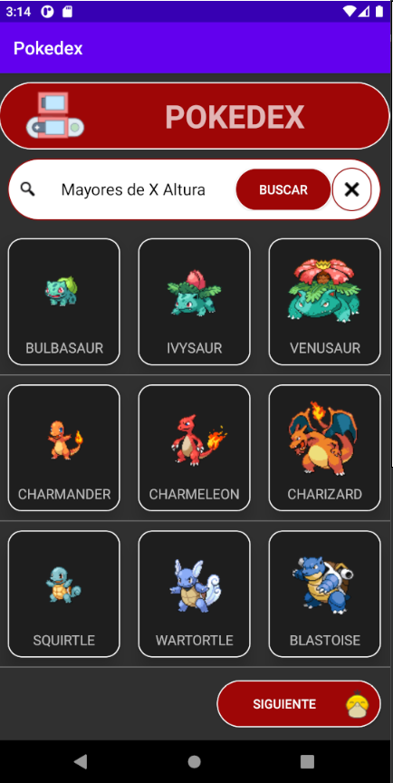
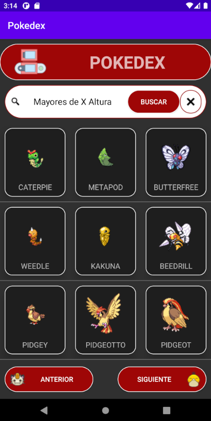
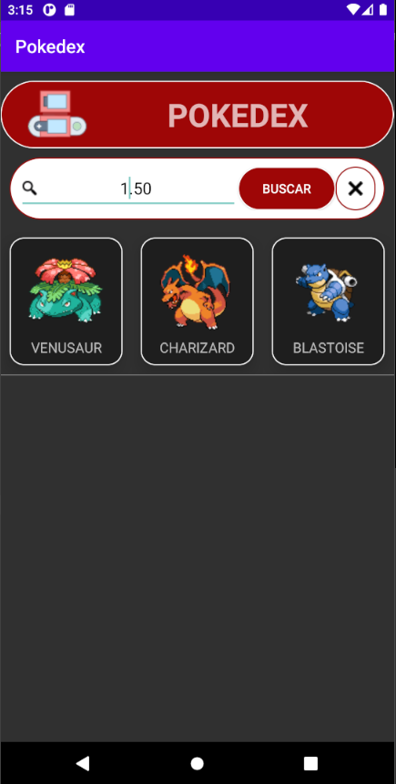
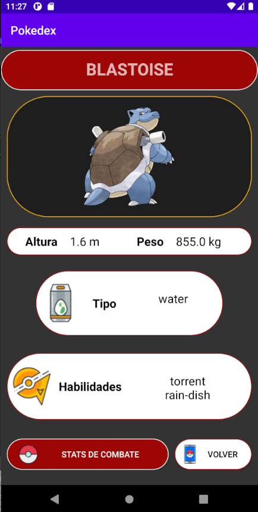
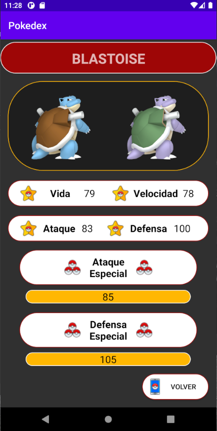

[]()

# Pokedex
Aplicacion de Android que simula el comportamiento de una Pokedex, ofreciendo datos y estadísticas sobre los Pokemon.

Cuenta con tres apartados, la Pokedex completa junto con un campo de busqueda por altura, la Informacion sobre Pokemon y los Stats de combate del mismo (imágenes más abajo).

Los datos se obtienen mediante una conexion con la API REST de Pokemon: pokeapi.co

Desarrollada por Eduardo Delgado a Marzo de 2022.

```
Target Device Phone
Target Screen Size >= 6 inch
Min SDK 22
```
- Pokedex General
                                                    



                       
- Informacion Detallada 
                                          


- Stats de Combate
                                     

